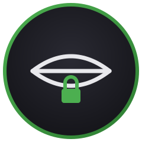
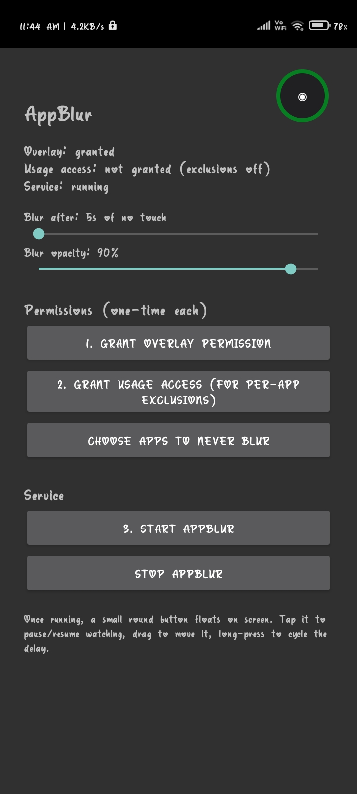
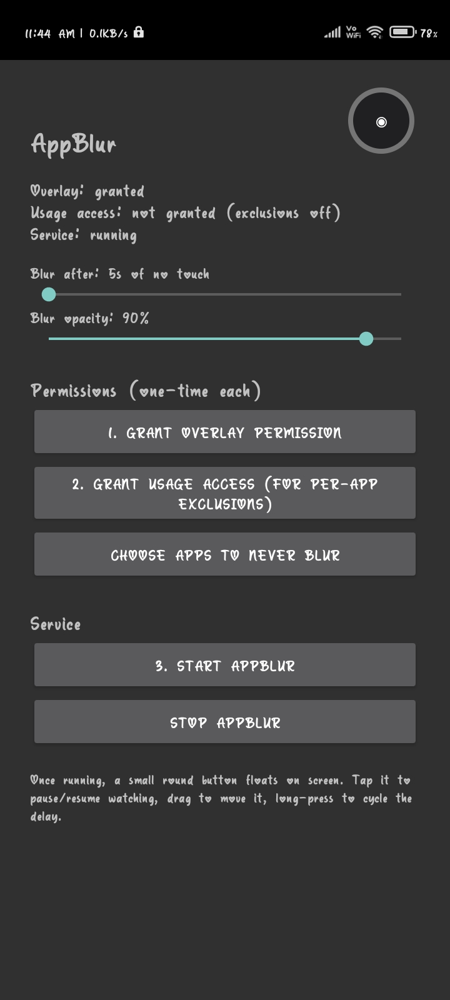
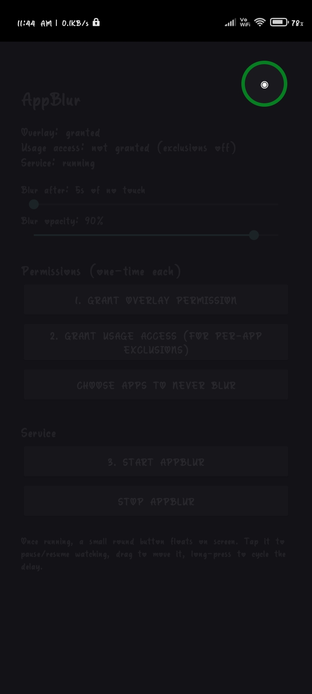

# AppBlur

### Idle-touch privacy screen for Android

*Blurs your entire screen when you stop touching it — so nobody shoulder-surfing gets to see what you're doing.*

---

## ⬇️ Download

**[Download latest APK]https://github.com/Abhi13-coder/App-blur/releases/download/App/app-debug.apk

> Grab this from the repo's **Releases** tab — it's a direct, permanent link that works without needing to log into GitHub. Actions-tab artifact links, by contrast, need a GitHub login and expire after 90 days, so they're not used here.

---

## ✨ What it does

- Watches for touch input across **every app on your phone** — not just inside AppBlur itself.
- If you don't touch the screen for a set delay (5–30 seconds, your choice), a solid privacy scrim fades in over everything.
- One tap dismisses it and resets the timer — completely transparent to normal use.
- A small floating round button lets you pause/resume watching on demand, drag it anywhere, and long-press to cycle the delay — no need to open the app.
- Opacity is fully adjustable (0–100%) via a slider, so you can dial in exactly how solid the scrim looks. Real-world tested: **90% opacity blocks a side-angle shoulder-surfer completely**, even readable text is unrecoverable from an angle.
- Optional per-app exclusion list — pick apps that should *never* trigger the blur (e.g. your launcher).
  ## 📸 In action

**Watching — idle timer counting down**

**Paused — tapped the floating button**

**Blur triggered after idle timeout**

## 🔒 How it works (the actual trick)

Android doesn't give normal apps a way to detect touches happening inside *other* apps. AppBlur works around this with a completely transparent, full-screen overlay window that is marked "not touchable" — every touch you make passes straight through it to whatever app is underneath, but the overlay also gets notified that a touch happened *somewhere*, system-wide. That's the idle-detection signal, with zero accessibility service and zero screen-recording permission required.

This is **not** true GPU-rendered Gaussian blur — real content blur needs Android 12+ (API 31), and this project targets phones running Android 10 and up. Instead, it's a solid-color privacy scrim at adjustable opacity, which in practice hides content just as effectively (arguably more reliably) than a soft blur.

## 📱 Supported Android versions

| | |
|---|---|
| **Minimum** | Android 10 (API 29) |
| **Target** | Android 14 (API 34) |
| **Tested on** | Redmi 9A (MediaTek Helio G25, Android 10) |

## 🔑 Permissions used (all one-time grants, none re-prompt)

| Permission | Why | Granted via |
|---|---|---|
| Display over other apps | Draw the privacy scrim and floating button | One-time Settings toggle |
| Usage access | Detect foreground app, for per-app exclusions (optional) | One-time Settings toggle |
| Notifications (Android 13+) | Required to keep the watcher running as a foreground service | One-time system dialog |
| Foreground service | Keeps the watcher alive in the background | Auto-granted at install |

No accessibility service. No screen-recording/MediaProjection permission. No internet permission — this app makes zero network calls.

## 🚀 Setup

1. Install the APK (see Download above, or build it yourself — see below).
2. Open AppBlur, tap through the two permission buttons (overlay, then usage access if you want exclusions).
3. Set your preferred delay and opacity with the sliders.
4. Tap **Start AppBlur**.
5. A round button appears floating on screen — tap to pause/resume, drag to reposition, long-press to cycle delay presets.

## 🛠️ Building it yourself

This project builds entirely via GitHub Actions — no local Android Studio or computer required.

1. Fork/clone this repo.
2. Push to `main`, or trigger the workflow manually from the **Actions** tab.
3. Download the built APK from the workflow run's artifacts, or from a tagged Release.

Build setup: AGP 8.5.2, Kotlin 1.9.24, Gradle 8.9 (pinned in the workflow), JDK 17, compileSdk 34, minSdk 29.

## ⚠️ Known limitations

- Solid scrim, not real optical blur (hardware/API-version constraint on older Android).
- The persistent notification while the watcher is running can't be hidden — this is an Android requirement for any foreground service, not a design choice.
- Per-app exclusion checks the foreground app right before triggering a blur; in rare rapid app-switch scenarios there can be a brief delay before it recognizes an excluded app is in front.

---

Built from a phone. No computer involved.

